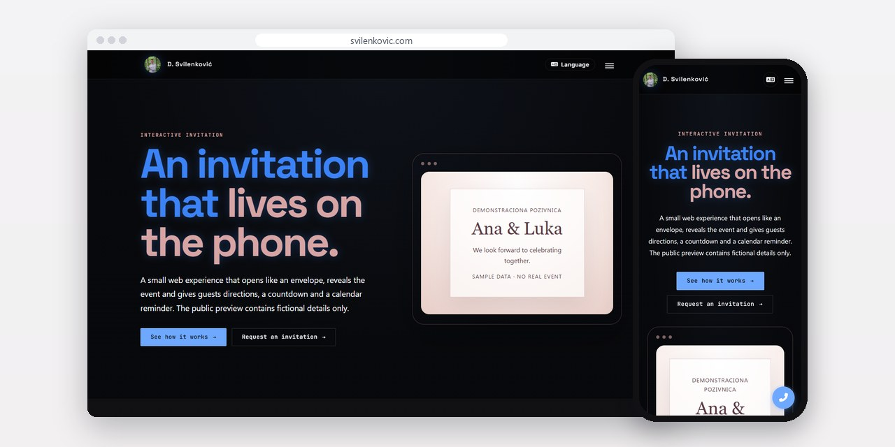
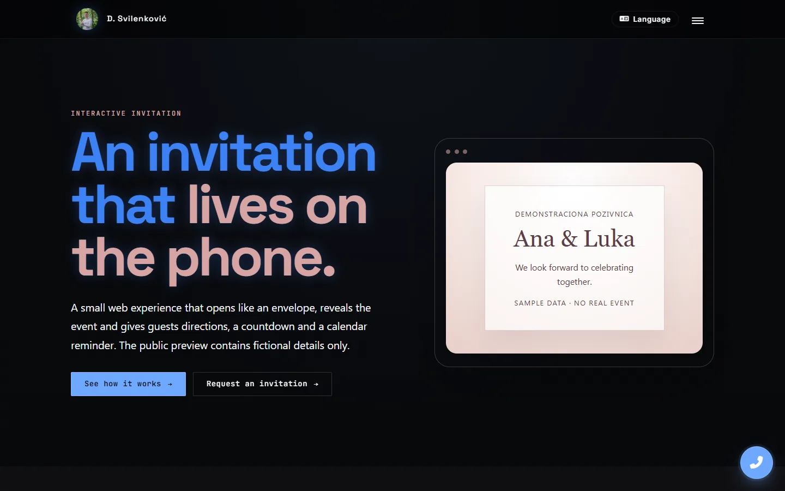
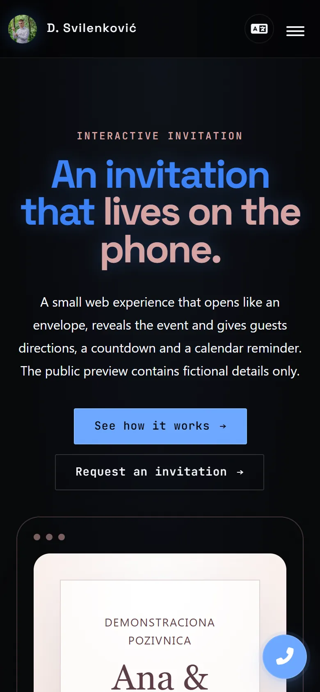

# Digitalna pozivnica

An invitation that opens like an envelope on the guest's phone, then shows the date, a countdown, directions and a calendar reminder.

[App page](https://svilenkovic.com/en/aplikacija-digitalna-pozivnica) · [Srpski](README.sr.md)

> [!NOTE]
> Client project. The source code belongs to the client and stays in a private repository. This page describes what I built and how.

<table>
  <tr><td><b>Client</b></td><td>Private client</td></tr>
  <tr><td><b>Industry</b></td><td>Private events</td></tr>
  <tr><td><b>Location</b></td><td>Serbia</td></tr>
  <tr><td><b>Type</b></td><td>Web invitation, one page per event</td></tr>
  <tr><td><b>My role</b></td><td>Design and development</td></tr>
  <tr><td><b>Stack</b></td><td>HTML, CSS, JavaScript, Canvas</td></tr>
</table>

## About the project

This is a web invitation I built for a client's private event, and every event gets its own page. Guests get a link, open it on their phone, and the page takes them from a closed envelope to the details of the day, with nothing to install and no account.

It is plain HTML, CSS and JavaScript. The envelope is a CSS 3D element that opens on the first tap. Confetti is drawn on a canvas and kept sparse so the details stay readable, and a countdown runs live to the start. The real invitation stays private: the names, photos, date, venue and the link to the original invitation are not in the portfolio, and the public preview uses made-up details.

## What I built

- A CSS 3D envelope that opens on the first tap and reveals the invitation
- A live countdown to the start of the event
- Canvas confetti held back so the text stays readable
- Directions and an add-to-calendar button, one tap each
- One static page per event, opened from a link, with no app and no account
- A separate public preview with invented names, so no real guest or event details are published

## Screenshots

<table>
  <tr>
    <td width="68%" valign="top"></td>
    <td width="32%" valign="top"></td>
  </tr>
</table>

---

Built by [D. Svilenković](https://svilenkovic.com).
